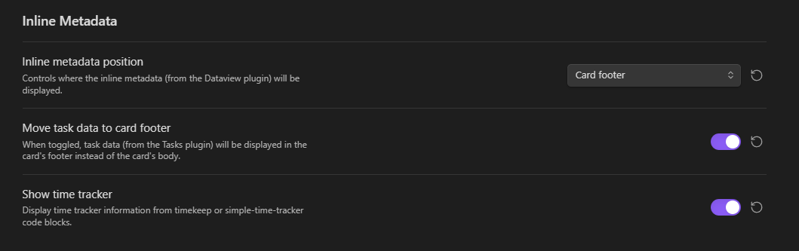
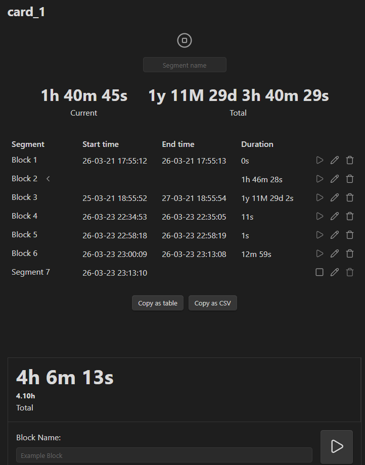
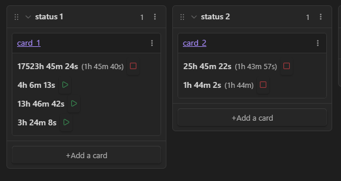

Look at [Original page](https://github.com/obsidian-community/obsidian-kanban) for basic info.

### What does this fork do?

This fork adds time tracking integration. There is a new toggler in settings:

If you turn it on, the plugin will parse all `timekeep` and `simple-time-tracker` code blocks from your files mentioned in Kanban board.

And then show them in Kanban board:

Everything should work intuitively, if it isn't, create an issue. I check them every few days.
